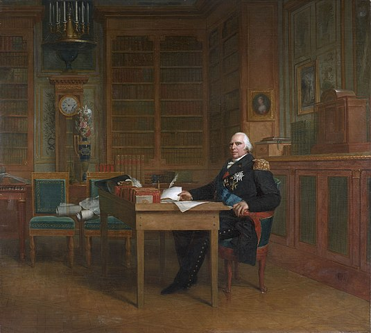
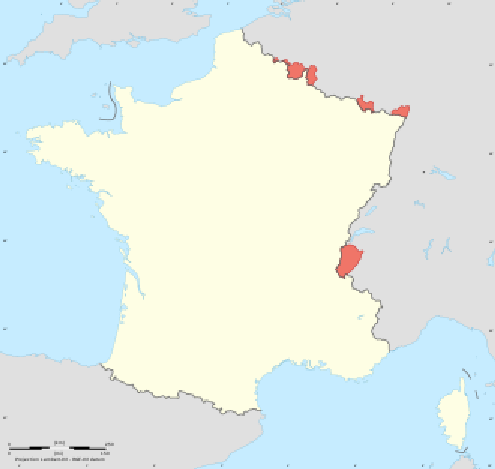
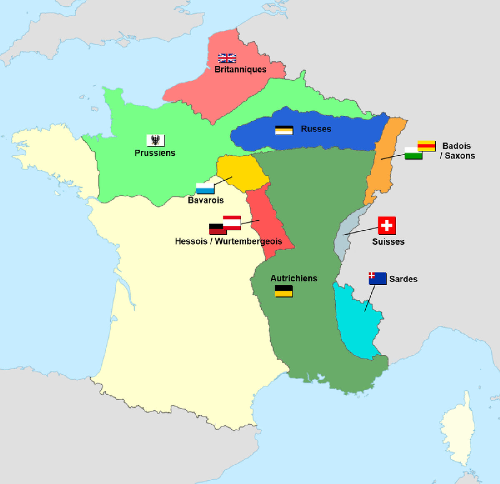
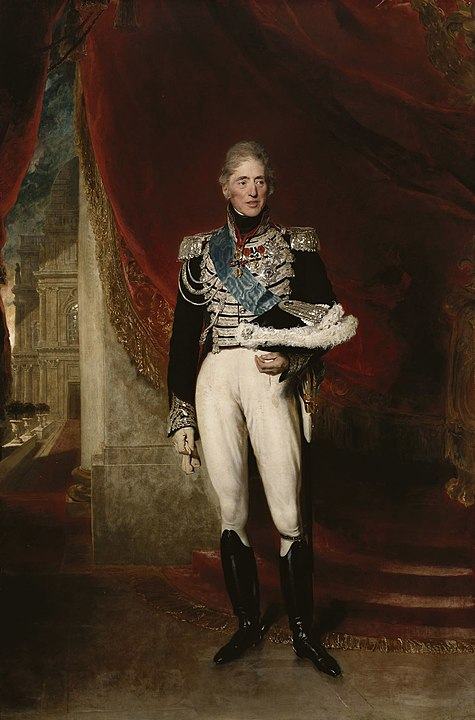

# La restauration (1814 -1830)

[NOTE]
====
 Ultramontain : 

 « Ultramontanisme » désigne les tendances romaines au sein de l'Église catholique qui affirment la primauté spirituelle et juridictionnelle du pape sur le pouvoir politique et donc la subordination de l'autorité civile à l'autorité ecclésiastique1.

 C'est une orientation principalement française qui s'oppose alors au gallicanisme qui, lui, prône le développement d'une Église nationale. Au xixe siècle, l'ultramontanisme s'oppose aux idées issues des bouleversements politiques et technologiques de la Révolution française et industrielle. Dans ces temps d'émergence des mouvements nationaux, des réactions ultramontaines apparaissent également en Allemagne, en Belgique, en Suisse et au Canada.

====

## Le retour des Bourbons

- La coalition défile et s'installe a Paris 31 mars 1814
- Le sénat dechoit Napoléon qui tente de se suicider avant d'abdiquer pour son fils puis sans conditions
- Exil de Napoléon a Elbe
- Louis XVIII est choisi pour régner (en exil en Europe après la révolution)
- Traité de Paris 30 mai 1814 : La France revient à ses limites de 1792

## La monarchie selon la charte

- Charte constitutionnelle du 4 juin 1814
- Confirmation d'acquis de la revolution et de l'Empire: code civil, droits de l'homme, tribunaux, liberté de culte
- Institution d'une monarchie constitutionnelle mais non parlementaire
- Chambre des pairs et chambre des députés
- Roi limité dans ses prérogatives mais a l'initiative des lois

## Retour de Napoléon

- Napoléon revient d’Elbe et marche sur Paris, il rallie bon nombre d'anciens soldats mécontent et de forces inquiète d'un retour à l'ancien régime
- Fuite du roi le 19 mars 1815
- Retour a la constitution de l'Empire avec quelques changements
- Les élections législatives donnent la majorité aux libéraux
- Réactivation de alliance contre la France
- Napoléon engage la campagne pour prendre la Belgique, mais subit une cuisante défaite à Waterloo. Il était de toute façon inimaginable qu'il puisse régner à nouveau ou vaincre la coalition.
- Exil définitif de Napoléon sur l'île de Sainte-Hélène et décès le 5 mai 1821
- Terreur Blanche : les ultra royaliste et le peuple se venge des agents de l'empire, préfets, gendarmes, ...
- Traité de Vienne : perte Savoie et pays de Gex. Armée d'occupation de 5 ans

## La victoire des ultra

- Les éléctions d'aout 1815 donne une majorité (350/402) aux ultra-royalistes
- Défense de du principe du gouvernement représentatif contre Louis XVIII qui choisisait ses ministres en dehors de la majorité
- Chateaubriand écrit l'opuscule : "De la Monarchie selon la Charte"
- Perception de la révolution comme un complot contre l'ordre social et la religion
- Ils voulaient une monarchie tempérée et limitée par des corps intermédiaires
- Ils veulent rétablir l'Eglise dans ses biens
- Le parti était structuré par des comité departementaux qui prolongait son action et par une association occulte, les Chevaliers de la Foi

## Le gouvernement des modérés

- L'opposition du roi avec la majorité le conduit à la dissoudre en septembre 1816
- Arrivé au pouvoir des modérés du parti constitutionel
- Le Duc de Richelieu réussi à rembourser l'indemnité de guerre en deux ans et obtient le retrait des troupes d'occupation avec deux ans d'avances
- La France rejoins la Sainte-Alliance : union visant à protéger les trones des revolutions
- Les éléctions partielles de 1817 et 1818 voient la réductions des forces ultra se poursuivre au profits des modérés
- Une opposition de gauche fait sont opposition sous la forme d'un parti libéral : La Fayette, Laffite, ..

## L'assasinat du Duc de Berry

 - Le Duc de berry seul homme pouvant onné un héritier q lq lignée des Bourbons est assassiné par un ouvrier bonapartiste le 13 février 1820 à la sortie de l'Opéra
 - Les ultras utilisent l'occasion pour faire voter un vote double pour les grands propriétaires terriens
 - Les éléctions partielles de 1820 et 1821 redonnent la majorité aux ultras
 - En 1824 lors des éléctions générales les ultra obtiennet 410 sièges sur 430
 - Le roi Louis XVIII meurt le 16 septembre 1824 de la gangrene

## Charles X roi de l'aristocratie
 

 - Dernier petit fils de Louis XV et comte d'Artois
 - Devennu très devot à la mort de son grand amour Louise de Polastron en 1804
 - Plus enclein à l'absolutisme que Louis XVIII son frère, en défaut de  tempérance et d'intélligence
 - Il s'allie au clergé et aux ultras pour gouverner
 - Se fait sacré à Reims contrairement à son prédecesseur et renoue avec les anciennes traditions
 - L'aspect mystique de la cérémonie ne prenait plus avec le peuple, un bonapartise (Béranger) composat "Le sacre de Charles le Simple" pour l'occasion 
 - Diverses loi choquèrent l'opposition :
    ** Indemnisation des nobles pour les biens confisqués à la Revolution
    ** Punission des sacrilèges
    ** Projets de loi pour rétablir le droit d'ainesse
 - Une association secrète la "Charbonnerie" comprenant : La Fayette, Buchezn Bazard fomente un complot pour renverser la monarchie en 1822.
 - Une branche plus extremiste des ultras se forma derrière : La Bourdonnaye et Chateaubriand, ils défendaient la liberté de la presse et l'alliance de le monarchie avec le peuple
 - En 1827 a la revue de la Garde nationale celle-ci manifesta en criant "Vive la Charte, à bas les minitres, à bas Villèle!" et fut dissoute

## Les "Trois Glorieuses" (27, 28, 29 Juillet 1830)

 - Villèle renvois la Chambre en espérant ramener le calme
 - Les modéré remporte la nouvelle election ce qui force Charles X à nommer le vicomte de Martignac
 - Charles X nomme un nouveau ministe en aout 1829, le prince Jules de Polignac incarnant l'ultracisme 
 - La Chambre répliqua avec une adresse au souverain lui demandant de respecter les voeux du peuple
 - Charles X refusa de renvoyer son gouvernement et renvoya la Chambre le 16 mai 1830
 - Les libéraux remportèrent de nouveau les éléctions avec 274 députés sur 430
 - Charles X utilisa l'article 14 de la Charte pour signé des décrets suspendant la liberté de la presse et dissolvant l'assemblée tout en modifiant la loi électorale le 25 juillet 1830
 - Ce coup d'état légal enflamma le peuple de Paris soutenus par les journaux et Adolphe Thiers érigèrent des barricades. Les émeutiers  s'emparèrent du Louvre et des Tuileries le 28 juillet
 - Le 30 jullet Charles X tenta de retirer ses ordonnances mais il était trop tard.
 - Dans la nuit Lafitte, Cassimir Perier et Thiers font afficher un appel au duc d'Orléans pour remplacer Charles X
 - Le 7 aout la Chambre et les pairs déclare le trône vacant et firent appel à Louis-Philippe.
 - Charles X et son fils abdiquèrent au profit du petit du de Bordeauxet partir pour l'exil
 
NOTE:  Chateaubriand écrivait : "Le temps des rois est passé [...] La monarchie n'est plus une religion."

## Bilan

[NOTE]
====
A préciser:

- Jacobinisme
-
- Quels sont les points de désaccord entre Louis XVIII et les ultra ?

A lire :

- "De la Monarchie selon la Charte" Chateaubriand
- "Le sacre de Charles le Simple" Béranger
====
